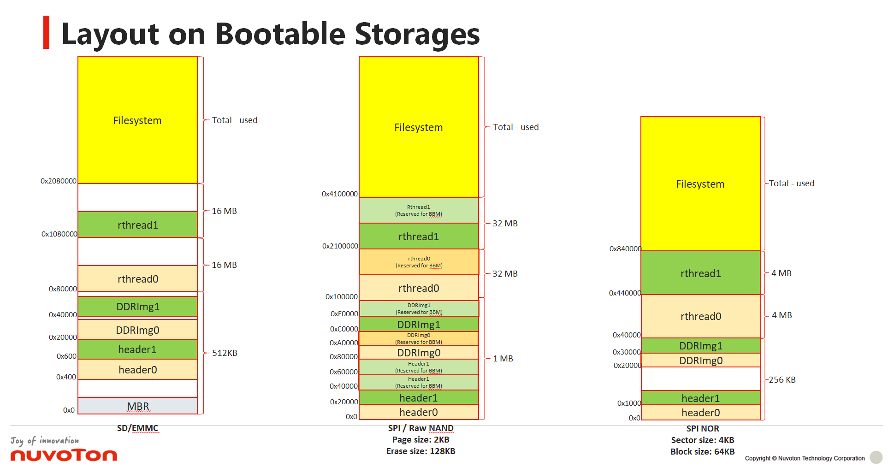

# **nuwriter_scripts**

Some scripts can help you program firmware into storages in this folder.

## **Requirement**

### [Python3 for Window](https://www.python.org/downloads/windows/)

After installing Python3, some plug-in as below must be installed.

```bash
pip3 install pyusb usb crypto ecdsa crcmod tqdm pycryptodome
```

Notice:

- Tested python3 version is 3.10.1.
- Please remember to add Python to PATH environment variable.

### [Libusb for Window](http://sourceforge.net/projects/libusb/files/libusb-1.0/libusb-1.0.20/libusb-1.0.20.7z/download)

On Windows platform, it is required to install libusb manually.

```bash
Step 1: Download the library extract the download file.
Step 2: Copy MS64\dll\libusb-1.0.dll to C:\Windows\System32.
Step 3: Copy MS64\dll\libusb-1.0.lib to C:\Users\<user name>\AppData\Local\Programs\Python\<python ver>\Lib.
```

### [USB Driver for Window](https://github.com/OpenNuvoton/MA35D1_NuWriter/blob/master/driver/WinUSB4NuVCOM.exe?raw=true)

NuWriter must install **WinUSB4NuVCOM.exe** on the computer.

## **Double-click Scripts for Windows**

If your NuWriter_MA35 python running is ready, you can do following batch script files for Window directly.

<p align="center">

</p>

### **nuwriter_ddr_download_and_run.bat**

Download rtthread.bin binary file into DDR. The address is 0x80800000.

### **nuwriter_program_sd.bat**

Program header0, DDR timing setting and rtthread.bin binary file into SD card or EMMC.

### **nuwriter_program_spinand.bat**

Program header0, DDR timing setting and rtthread.bin binary file into SPI NAND flash.

### **nuwriter_program_rawnand.bat**

Program header0, DDR timing setting and rtthread.bin binary file into NAND flash.

### **nuwriter_program_sd_pack1.bat**

Program header1, DDR timing setting and rtthread.bin binary file into SD card or EMMC.

### **nuwriter_program_spinand_pack1.bat**

Program header1, DDR timing setting and rtthread.bin binary file into SPI NAND flash.

### **nuwriter_program_rawnand_pack1.bat**

Program header1, DDR timing setting and rtthread.bin binary file into NAND flash.

### **nuwriter_program_spinor_pack1.bat**

Program header1, DDR timing setting and rtthread.bin binary file into SPI NOR flash.

## **In-system Programming**

- Provide firmware updating way in rt-thread system.
- An in-system programming utility for rt-thread called nuwriter available for firmware updating.

```bash
msh />nuwriter
usage: nuwriter [option] [target] ...

usage options:
  -h,              --help          Print defined help message.
  -f URI,          --file=URI      Specify NuWriter Pack file.(local).
  -d Device name,  --device=device Specify device name.
  -p,              --program       Execute program.
  -r,              --readback      Read back from storage.

For examples,
nuwriter -f /mnt/udisk/pack.bin
nuwriter -f /mnt/udisk/pack.bin -d sd1 --program
nuwriter -f /mnt/udisk/pack.bin -d nand2 --program
nuwriter -f /mnt/udisk/pack.bin -d rawnd2 --program
nuwriter -f /mnt/udisk/pack.bin -d sf_whole --program
nuwriter -f /nand0.bin -d nand0 --readback
```

- IBR compares version number of both header0 and header1 and load bigger version number firmware to run.
- The headerX.bin image must be placed at first in packX.bin file.
- SPI/RAW NAND flash need reserve **Enough Valid Blocks** for skipping bad-block mechanism.
- Dual-headers must be placed in various storage device as below:

|Boot Storage|header0 offset|header1 offset|Note|
|-|-|-|-|
|SD|Sector 2, 0x400|Sector 3, 0x600|<ul><li>Sector size is 512B</li><li>Sector 0 is MBR</li></ul>|
|eMMC|Sector 2, 0x400|Sector 3, 0x600|<ul><li>Sector size is 512B</li><li>Sector 0 is MBR</li></ul>|
|Raw NAND|Block 0, 0x0|Block 1, 0x20000|<ul><li>Block size = PSxPPB</li><li>Image start address must be block-alignment.</li></ul> |
|SPI NAND|Block 0, 0x0|Block 1, 0x20000|<ul><li>Block size = PSxPPB</li><li>Image offset address must be block-alignment.</li><li>The page of block(PPB) SPI NAND flash must be 64, 128 or 256.</li></ul> |
|SPINOR|Sector 0, 0x0|Sector 1, 0x1000|<ul><li>Block size = 64KB</li><li>Sector size = 4KB</li><li>SPI NOR flash need supports 4KB-sector erase size.</li></ul> |

## **Bash Scripts for Linux**

If your NuWriter_MA35 python running is ready, you can do following bash script files for Linux directly.
If not, the **install_linux.sh** will help user to install related python module installation.

```bash
# ./install_linux.sh
```

### **nuwriter_ddr_download_and_run.sh**

Download rtthread.bin binary file into DDR. The address is 0x80800000.

### **nuwriter_program_sd.sh**

Program header0, DDR timing setting and rtthread.bin binary file into SD card or EMMC.

### **nuwriter_program_spinand.sh**

Program header0, DDR timing setting and rtthread.bin binary file into SPI NAND flash.

### **nuwriter_program_rawnand.sh**

Program header0, DDR timing setting and rtthread.bin binary file into NAND flash.

### **nuwriter_program_spinor.sh**

Program header0, DDR timing setting and rtthread.bin binary file into SPI NOR flash.

## **Troubleshoot**

### **Fail to create symbolic folder**

```bash
Create symbolic folder conv failed
```

- To switch **Developer Mode** in Window. To enter [Settings], [Update & Security], [For developers], [Developer Mode] page, then set it **On**
- Use **Administrator** permission to install python3, libusb and utilities.

### **Use NuWriter_MA35.exe**

Due to the python execution file size and saving network bandwidth, we just only release the python code in this repository. We also provide [NuWriter_MA35.exe](https://github.com/OpenNuvoton/MA35D1_NuWriter/blob/master/EXE/NuWriter_MA35.exe?raw=true) python execution. You can run the packaged app without installing a Python interpreter or any modules. You can use **NuWriter_MA35.exe** and do some modification.

```bash
To modify "py -3 nuwriter.py" to "NuWriter_MA35.exe"
```

For example, the **nuwriter_ddr_download_and_run.bat** modification is as following:

```bash
:forever_develop
NuWriter_MA35.exe -a ddrimg\enc_ddr3_winbond_256mb.bin
IF %ERRORLEVEL% EQU 0 (
   NuWriter_MA35.exe -o execute -w ddr 0x80800000 ..\rtthread.bin
)
pause
goto :forever_develop
```

## **See also**

[NuWriter Repository](https://github.com/OpenNuvoton/MA35D1_NuWriter)
